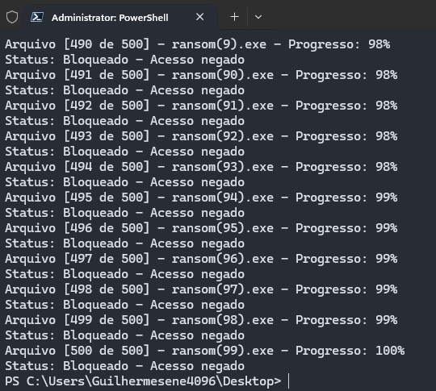
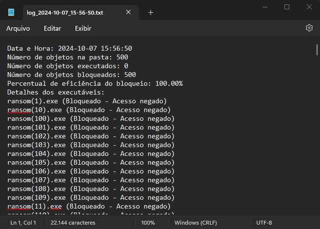

# Malex - Automação para teste de malware

## O que é o script?

Este é um script automatizado para execução controlada de arquivos executáveis, com o objetivo de realizar testes de malware em um ambiente controlado. Ele identifica, tenta executar e monitora arquivos executáveis, como malwares, em uma pasta específica. O script registra se os arquivos foram executados ou bloqueados, calculando a eficiência de bloqueio e gerando logs detalhados sobre cada arquivo. Isso é útil para avaliar a eficácia de sistemas de proteção em tempo real, como antivírus, ao lidar com arquivos maliciosos.

<p align="center">
  
  
</p>


## Funcionalidades Principais

O script oferece as seguintes funcionalidades, todas ajustáveis no código:

- Verificação e execução de arquivos maliciosos ou potencialmente maliciosos (.exe, .msi, .jar, .java, .pdf) em uma pasta específica.
- Monitoramento de proteção em tempo real, com identificação de arquivos bloqueados.
- Geração de logs detalhados sobre a execução ou bloqueio de cada arquivo.
- Cálculo de eficiência de bloqueio, útil para testes de antivírus ou outras soluções de segurança.
- Abertura automática do log gerado após a execução.

## Como Executar

### Requisitos:

- **Sistema Operacional:** Windows 10 ou superior.
- **Requisitos de software:** Ter o Python instalado no sistema operacional.
- **Permissões:** A execução requer permissões de administrador.
- **Ambiente Controlado:** É altamente recomendado executar o script em um ambiente isolado, como uma máquina virtual ou sandbox, especialmente quando lidando com malwares.

### Passos para execução:

1. **Baixar o script:**

   Clone o repositório ou faça o download do script diretamente:

   ```bash
   git clone https://bitbucket.org/guilhermesene/malex.git
   ```

2. **Dar permissão de execução ao script:**

   Navegue até o diretório onde o script está localizado e use o seguinte comando (em PowerShell ou CMD, para scripts Python):

   ```bash
   python malex.py
   ```

3. **Inserir as opções de configuração:**

   O script solicitará o caminho da pasta onde os executáveis estão localizados e se a proteção em tempo real (como antivírus) está ativada. Certifique-se de fornecer essas informações corretamente.

4. **Executar o script:**

   Após inserir as informações solicitadas, o script realizará a execução dos arquivos e gerará um log com os resultados detalhados.

5. **Acompanhar as etapas:**

   O progresso da execução de cada arquivo será exibido no terminal. O script indicará se os arquivos foram executados ou bloqueados.

## Logs

O script gera um arquivo de log com o seguinte formato: `log_YYYY-MM-DD_HH-MM-SS.txt`, que inclui:

- Data e hora da execução.
- Número total de arquivos na pasta.
- Número de arquivos executados com sucesso.
- Número de arquivos bloqueados.
- Percentual de eficiência de bloqueio.
- Detalhes de cada arquivo executável, incluindo o status de bloqueio ou execução.

Este log é útil para realizar análises pós-teste, ajudando a avaliar a capacidade do sistema de proteção em detectar e bloquear malwares.

## Observações Importantes

- **Cuidado:** O uso deste script deve ser feito em ambientes controlados e isolados, como máquinas virtuais ou sandboxes. A execução de malwares pode causar danos ao sistema, caso não haja um isolamento adequado.
- **Antivírus:** Certifique-se de que o software de proteção está configurado corretamente para monitorar o comportamento dos arquivos executáveis e registrar as ações no log.

